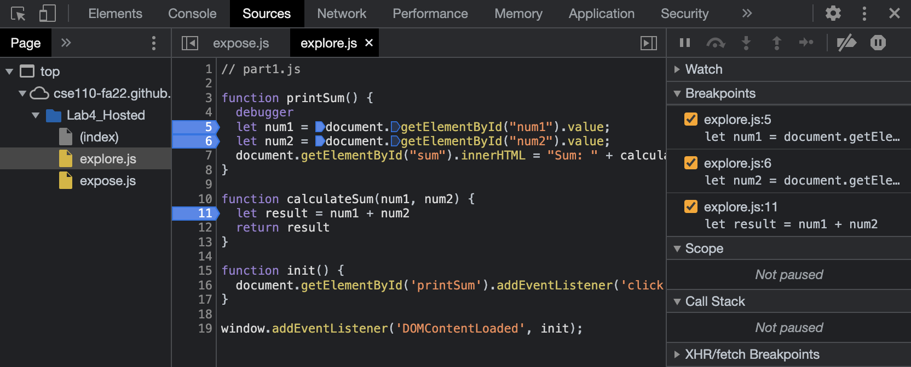
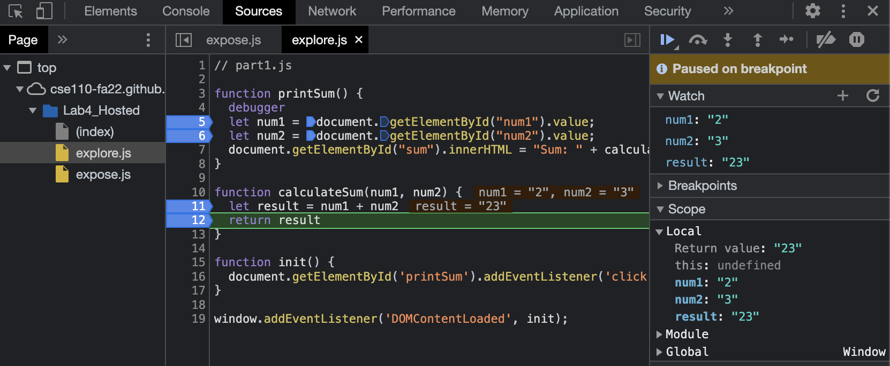
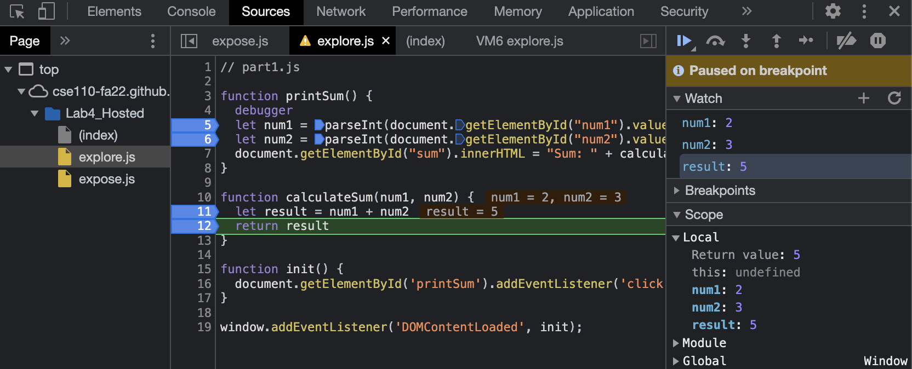

# BreakPoint image

# Watch Image

1. The bug is: when we read users inputs num1 and num2, they are strings. So if we do string + string, for example, "2" + "3", we will get a string "23".
2. I use parseInt to convert num1 and num2 into ints.
   

